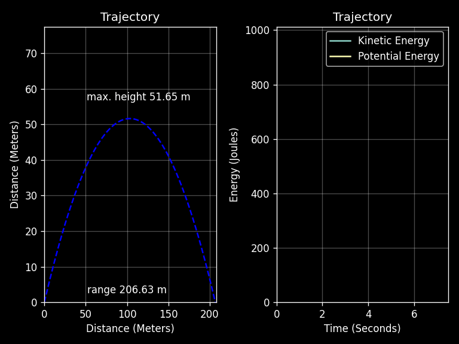

# Projectile Motion Simulator

This project visualizes the motion of a projectile launched at an initial speed and angle using classical mechanics equations. The simulation displays both the **trajectory** of the projectile and the changes in **kinetic** and **potential** energy over time. Made for educational purposes.

## 🎯 Features
- User input for initial velocity and launch angle
- Plots:
  - Projectile trajectory
  - Kinetic vs Potential energy over time
- Animated visualization using `matplotlib.animation`
- Smooth real-time motion update

## 📊 Example Visualization:



> To create the GIF, uncomment the following line in the script:
```python
animation.save("projectile_motion.gif", dpi=120)
```
#### Description was partially written with assistance form AI for clarity. All code is original and hand-written by me.
